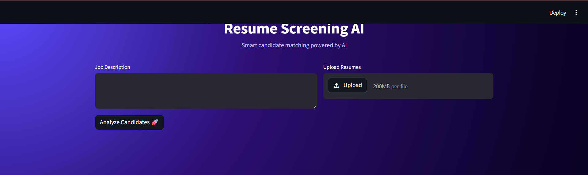
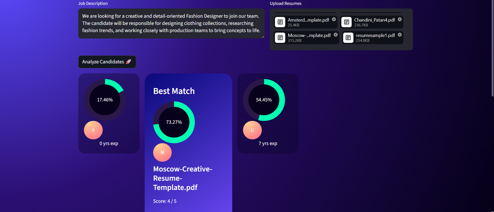
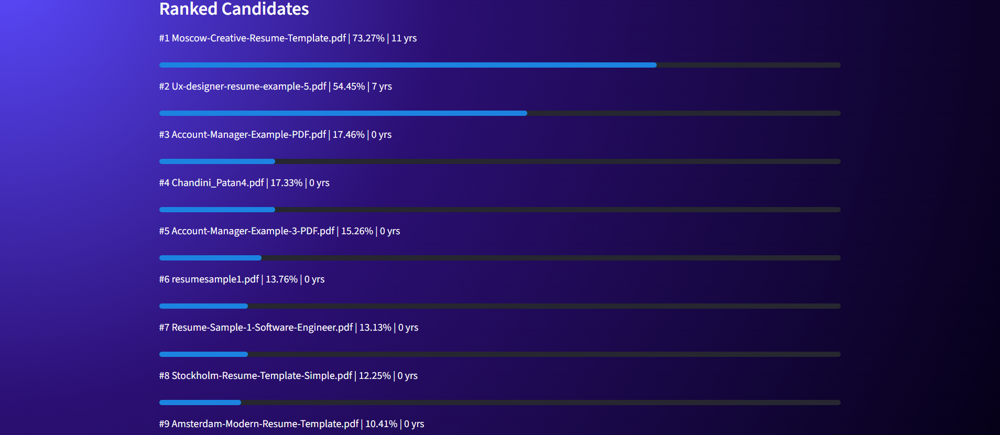

# 🤖 Resume Screening AI

An AI-powered Resume Screening System that intelligently ranks candidates based on job descriptions using **semantic understanding, experience weighting, and skill matching**.

---

## 🚀 Features

- 📄 Upload multiple resumes (PDF)
- 🧠 AI-based semantic matching using Sentence Transformers
- 📊 Experience-based candidate prioritization
- 🎯 ATS-like scoring system
- 🏆 Top 3 candidate highlight UI
- 📈 Ranked candidate list with match percentage
- 🔍 Skill match insights

---

## ⚙️ How It Works

1. Extracts text from uploaded resumes  
2. Converts text into embeddings using NLP models  
3. Compares resume content with job description  
4. Calculates:
   - Semantic similarity  
   - Skill match score  
   - Experience score  
5. Generates final ranking of candidates  

---

## 🛠 Tech Stack

- Python  
- Streamlit  
- Sentence Transformers  
- PyTorch  
- Scikit-learn  
- NLP  

---

## 📸 Project Screenshots

### 🏠 Home Page
<p align="center">
  
</p>

### 📤 Resume Upload
<p align="center">
  
</p>

### 📊 Results Dashboard
<p align="center">
  
</p>

---

## ▶️ Installation & Run

```bash
pip install -r requirements.txt
streamlit run app.py